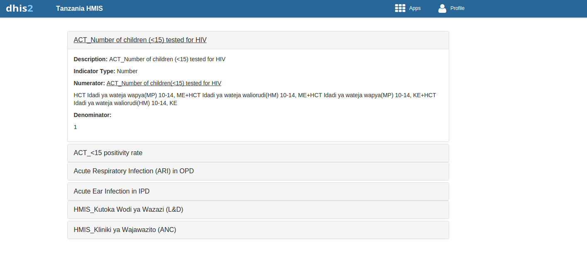

# ng2-metadata-dictionary
This in an [angular2](https://angular.io/) component to be used to add a metadatadictionarycomponent within DHIS apps.

## Installation
This component assumes that the angular app is created using [angular cli](https://cli.angular.io/).
To use this component download it from git [here](https://github.com/hisptz/metadatadictionarycomponent), You need just a single file ng2-dhis-org-unit-tree.ts.
 
```

Include the metadatadictionarycomponent.ts file file anywhere in your app folder and add it to the main component at app.module.ts as follows:

```javascript
import { BrowserModule } from '@angular/platform-browser';
import { NgModule } from '@angular/core';
import { FormsModule } from '@angular/forms';
import { HttpModule } from '@angular/http';

import { AppComponent } from './app.component';
import {DhisMenuComponent} from "./dhis-menu/ng2-dhis-menu";
import { MetadataDictionaryComponent } from './metadata-dictionary/metadata-dictionary.component';

@NgModule({
  declarations: [
    AppComponent,
    DhisMenuComponent,
    MetadataDictionaryComponent
  ],
  imports: [
    BrowserModule,
    FormsModule,
    HttpModule
  ],
  providers: [ ],
  bootstrap: [AppComponent]
})
export class AppModule { }
```

You can see that I have added the MetadataDictionaryComponent in the import part of @ngModule and MetadataDictionaryComponent on the declaration part.

To see the Metadata dictionary components where you want to use as follows:
```html
 <app-metadata-dictionary [metadataidentifiers]="'UbnP1Kth7oJ;hk8DwZuW4Ay;tl85FnvL8do;Q7zFIIoqCdI;zeEp4Xu2GOm;GzvLb3XVZbR'"></app-metadata-dictionary>

```
 

 
So you can pass the metadatauids as it is from analytics link eg
'UbnP1Kth7oJ;hk8DwZuW4Ay;tl85FnvL8do;Q7zFIIoqCdI;zeEp4Xu2GOm;GzvLb3XVZbR';


Final results

